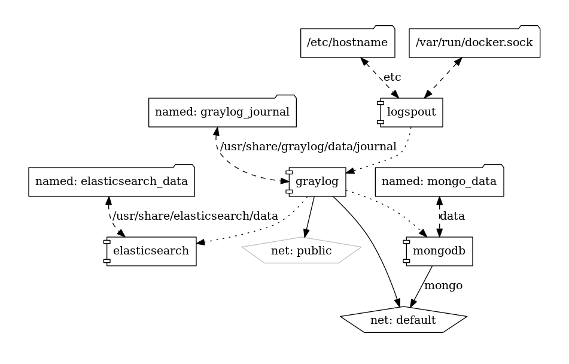

# Graylog logging stack for [osparc-simcore]

Creates a stack to aggregate logs from any running stack/containers. The logs are pulled from the running container by [Logspout-GELF](https://github.com/Vincit/logspout-gelf), converted and sent to the [Graylog server](https://www.graylog.org/), which uses [MongoDB](https://www.mongodb.com/) and [elasticsearch](https://www.elastic.co/) as backends.



## Usage

```console
make help
make up
make down
```

## Configuration

1. Create a GELF UDP INPUT
2. Show incoming messages
3. All the docker container messages shall be visible
4. Send a message following through the console:

```console
echo -n '{ "version": "1.1", "host": "example.org", "short_message": "A short message", "level": 5, "_some_info": "foo" }' | nc -w0 -u localhost 12201
```

### alternative option: configure docker daemon to re-direct to gelf address

This needs to be added to /etc/docker/daemon.json

```json
    "log-driver": "gelf",
    "log-opts": {
      "gelf-address": "udp://127.0.0.1:12201"
    }
```

Restart the docker daemon after the modifications.

**Note:** In that case logspout is not necessary, BUT the downside is that all commands relying on "docker logs" will then fail.
